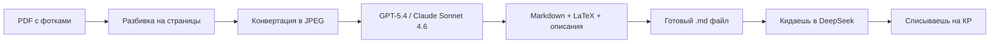

# LectureKiller

## Превращаю мутные фотки лекций в чистый конспект за 100 рублей

[](https://python.org)
[](https://opensource.org/licenses/MIT)
[](https://openai.com)

> **История одного страдания:** Преподы не выкладывают материалы. Студенты фоткают презентации на телефон в конце пары. Потом эти 47 фоток склеиваются в PDF. А дальше — ад. Текст оборван, графики не разобрать, формулы плывут. Переписывать руками — 3 часа. Готовиться по фоткам — глаза вытекут. А на контрольной хочется просто скормить конспект GPT и спросить "емае, как там эта формула?".

**Решение:** Закидываешь PDF с фотками → получаешь идеальный Markdown с формулами и описаниями графиков. Потом этот файл можно скормить любому бесплатному DeepSeek и он ответит на любой вопрос так, будто видел исходные слайды.

---

## Проблемы, которые я решил

| Проблема                     | Как было                                  | Как стало                                                                            |
| ---------------------------- | ----------------------------------------- | ------------------------------------------------------------------------------------ |
| **Фотки — говно**            | Оборванный текст, размытые графики, блики | Модель восстанавливает по контексту, дорисовывает формулы, описывает графики словами |
| **Платить за ChatGPT Plus**  | 2000 руб/месяц — нахрен                   | Платишь ~30 рублей за лекцию разово                                                 |
| **Инфы не хватает**          | Нужно гуглить, сидеть на википедии        | Модель сама докручивает пропуски по логике лекции                                    |
| **На кр списывать неудобно** | Бесплатный GPT не видит картинки в PDF    | Получаешь текст → кидаешь в DeepSeek → он всё помнит → списываешь за секунду         |

---

## 🎯 Что ты получаешь на выходе

### Вход (то, что у тебя есть)
```
input_pdfs/
├── лекция1_фотки.pdf      # 6 мутных страниц с графиками
├── лекция2_фотки.pdf      # 5 страниц с формулами
└── лекция3_фотки.pdf      # 8 страниц с таблицами
```

### Выход (то, что ты хочешь)
```
output_markdown/
├── лекция1_фотки.md       # Чистый текст + формулы в LaTeX
├── лекция2_фотки.md       # + описание каждого графика в ---
└── лекция3_фотки.md       # + структура: заголовки, списки

```

### Пример того, что внутри `.md` файла:

```markdown
# Кинематика материальной точки

## Основные определения

Кинематика изучает движение тел без учёта причин, вызывающих это движение. 
Радиус-вектор $\vec{r}(t)$ задает положение точки в пространстве.

---

**График 1**: Зависимость скорости от времени.
График представляет собой прямую линию из точки (0, 2) в (4, 6).
Ось X: время (с), от 0 до 4. Ось Y: скорость (м/с), от 0 до 8.
Уравнение: $v_x(t) = t + 2$ — равноускоренное движение с ускорением 1 м/с².

---

## Формулы для списывания

Скорость: $$v = \frac{ds}{dt}$$

Ускорение: $$a = \frac{dv}{dt} = \frac{d^2s}{dt^2}$$
```

---

## Как это работает (для тех кто в теме)



**Что происходит под капотом:**
1. Скрипт режет PDF на отдельные картинки (по странице)
2. Отправляет ВСЕ картинки одной лекции за ОДИН запрос к GPT-5.4
3. Модель видит: оборванный текст, размытые графики, формулы
4. Она восстанавливает связный текст, переводит формулы в LaTeX
5. Каждый график описывает текстом: оси, тренды, ключевые точки
6. Сохраняет в `.md` файл с заголовками, списками, выделениями

**Результат:** ты можешь скормить этот `.md` любому бесплатному DeepSeek и он ответит на любой вопрос по лекции так, как будто видел исходные слайды. Потому что описание графиков настолько подробное, что ИИ восстанавливает картинку в голове.

---

## 💸 Сколько это стоит

| Модель                     | Цена за лекцию (20 страниц) | Качество        |
| -------------------------- | -------------------------- | --------------- |
| **GPT-5.4** (через прокси) | ~30 рублей                 | 🔥 Максимальное |
| **Claude Sonnet 4.6**      | ~30 рублей                 | 🔥 Отличное     |
| **GPT-4o**                 | ~15 рублей                 | 👍 Хорошее      |
| **Gemini Flash**           | ~3 рубля                   | 👌 Бюджетное    |

---

## Быстрый старт

### 1. Склонируй репозиторий
```bash
git clone https://github.com/ex-alander/LectureKiller.git
cd LectureKiller
```

### 2. Создай виртуальное окружение (Windows)
```cmd
python -m venv venv
venv\Scripts\activate
```

### 3. Установи зависимости
```cmd
pip install -r requirements.txt
```

### 4. Настрой API ключ
```cmd
copy .env.example .env
```
Открой `.env` и вставь свой API ключ:
```
API_KEY=твой_ключ_сюда
```

### 5. Положи PDF в папку
Скопируй свои PDF в `input_pdfs/`

### 6. Запусти
```cmd
python run.py
```

### 7. Получи результат
Смотри `output_markdown/` — там лежат твои конспекты.

---

## Структура проекта

```
LectureKiller/
├── src/                    # Код (8 модулей, каждый отвечает за своё)
│   ├── cli.py             # Точка входа
│   ├── config.py          # Настройки из .env
│   ├── pdf_converter.py   # Режет PDF на картинки
│   ├── api_client.py      # Общается с GPT/Claude
│   ├── prompts.py         # Инструкции для модели
│   └── ...
├── input_pdfs/            # Сюда кидаешь PDF
├── output_markdown/       # Сюда падают конспекты
├── .env                   # Твой API ключ
└── run.py                 # Запускалка
```

---

## Поддерживаемые модели

| Модель | Vision | Цена input/1M | Цена output/1M |
|--------|--------|---------------|----------------|
| **GPT-5.4** | ✅ | $2.50 | $15.00 |
| **Claude Sonnet 4.6** | ✅ | $3.00 | $15.00 |
| **GPT-4o** | ✅ | $2.50 | $10.00 |
| **Gemini 1.5 Flash** | ✅ | $0.075 | $0.30 |

Просто поменяй `MODEL_NAME` в `.env` и пользуйся.

---

## FAQ

**Q: А если на фотке вообще нихера не видно?**  
A: Модель восстановит по контексту. Она понимает логику лекции и дорисует недостающее.

**Q: Графики реально распознаются?**  
A: Да. Модель пишет: "тип графика — линейный, ось X — время от 0 до 10, ось Y — скорость от 0 до 20, в точке t=5 значение v=12". DeepSeek после такого описания отвечает на вопросы как будто график видел.

**Q: Сколько стоит обработать 10 лекций?**  
A: Если через GPT-5.4 — ~300 рублей. Если через Gemini Flash — ~30 рублей.

**Q: Мне нужен ChatGPT Plus?**  
A: Нет. Ты платишь только за API токены. Разово. Без подписки.

**Q: А если я не прогер?**  
A: Установил Python → скопировал команды → запустил. Всё работает.

---

## 📄 Лицензия

MIT — делай что хочешь. Форкай, меняй, продавай конспекты одногруппникам.

---

## 🙏 Благодарности

- DeepSeek — за то что объяснил как это всё собрать (без него бы я намучался)
- Преподам которые не выкладывают материалы — без вас бы этого проекта не было
- Фёдору Соколову - за то, что ты не отвечал достаточно долго для того, чтобы я решил эту проблему сам
---

## Если помогло

Поставь звезду на GitHub. Или кинь 100 рублей на кофе — я потратил 3 часа чтобы ты списывал без боли. Обращаться в телегу.

**Было:** 3 часа переписывать лекцию вручную  
**Стало:** 30 рублей, 10 минут настройки и 1 минута ожидания  

Выбор очевиден. 😎
