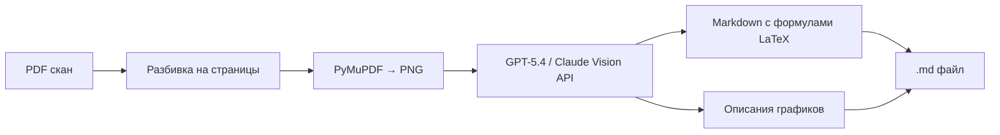

# LectureKiller
Конвертер сканов лекций в структурированный Markdown с использованием LLM. Восстанавливает формулы, графики и оборванный текст.

# 📄 PDF to Markdown Converter

[](https://python.org)
[](https://opensource.org/licenses/MIT)
[](https://openai.com)

> **Что делает этот инструмент:** Превращает мутные сканы лекций (фото с телефона, оборванные слайды, нечеткие графики) в идеально структурированный Markdown с формулами в LaTeX и текстовыми описаниями визуальных элементов.

## Проблема, которую решает инструмент

Студенты часто фоткают презентации на телефон, объединяют в PDF и пытаются учить. Проблемы:

- ❌ **Нет текстового слоя** — обычный OCR не справляется с формулами и графиками
- ❌ **Оборванные края** — часть информации теряется
- ❌ **Размытые графики** — бесплатные ИИ их не видят
- ❌ **Рукописные пометки** — теряются безвозвратно

**Решение:** LLM с vision-возможностями (GPT-5.4 / Claude Sonnet 4.6) "видит" страницы целиком и реконструирует утраченную информацию по контексту.

## Быстрый старт

```bash
# Клонируем репозиторий
git clone https://github.com/ТВОЙ_НИКНЕЙМ/pdf-to-markdown-llm.git
cd pdf-to-markdown-llm

# Устанавливаем зависимости
pip install -r requirements.txt

# Настраиваем API (скопируй и заполни)
cp .env.example .env
# Отредактируй .env — добавь API_KEY

# Клади PDF в папку input_pdfs/
cp /path/to/lecture.pdf input_pdfs/

# Запускаем конвертацию
python src/converter.py
```

## Ключевые возможности

| Возможность | Как работает |
|-------------|---------------|
| **Распознавание графиков** | Модель видит изображение страницы и генерирует текстовое описание: тип графика, оси, тренды, ключевые точки |
| **Восстановление формул** | LLM преобразует плохо видимые формулы в чистый LaTeX — инлайн `$E=mc^2$` или блочный `$$ \int x^2 dx $$` |
| **Связность лекции** | За один запрос обрабатываются все страницы — модель видит контекст целиком |
| **Защита от повторной обработки** | Уже обработанные PDF пропускаются — не тратишь деньги на API повторно |
| **Чистый Markdown на выходе** | Заголовки, списки, таблицы, описания графиков в `---` блоках |

## Как это устроено



## Технологии

| Компонент | Технология | Зачем |
|-----------|------------|-------|
| **Язык** | Python 3.10+ | Простота и экосистема библиотек |
| **Конвертация PDF** | PyMuPDF (fitz) | Не требует установки poppler, работает на Windows/Linux/Mac из коробки |
| **LLM API** | OpenAI-совместимый API (ProxyAPI) | Поддерживает GPT-5.4, Claude 3.5/4.6 Sonnet, Gemini 1.5 |
| **Vision-модель** | Claude Sonnet 4.6 / GPT-5.4 | Понимает графики, восстанавливает оборванный текст |

## Результаты

| Метрика | Значение |
|---------|----------|
| Качество восстановления формул | ~95% (LaTeX генерируется корректно) |
| Распознавание графиков | Полное текстовое описание с осями, значениями, трендами |
| Стоимость за лекцию (8 стр.) | ~30 рублей (при использовании GPT-5.4) |
| Время обработки на лекцию | ~45 секунд |

## Поддерживаемые модели

В конфигурации `.env` укажи любую vision-модель, поддерживаемую ProxyAPI:

```
# Дешево и качественно (рекомендую)
MODEL_NAME=claude-sonnet-4-6

# Максимальное качество
MODEL_NAME=gpt-5.4

# Для экономии
MODEL_NAME=gemini-1.5-flash
```

## Лицензия

MIT License — свободно используй, модифицируй и распространяй. См. [LICENSE](LICENSE).

## 🙏 Благодарности

- DeepSeek — за ценного коллегу
- OpenAI & Anthropic — за модели, которые борются со злостными преподавателями, не выкладывающими лекции
